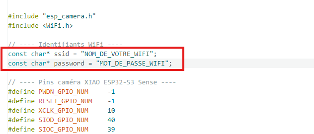
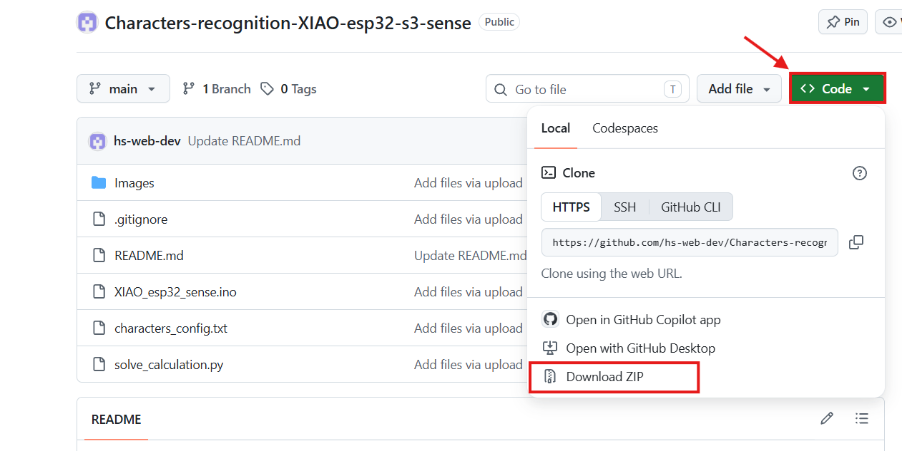
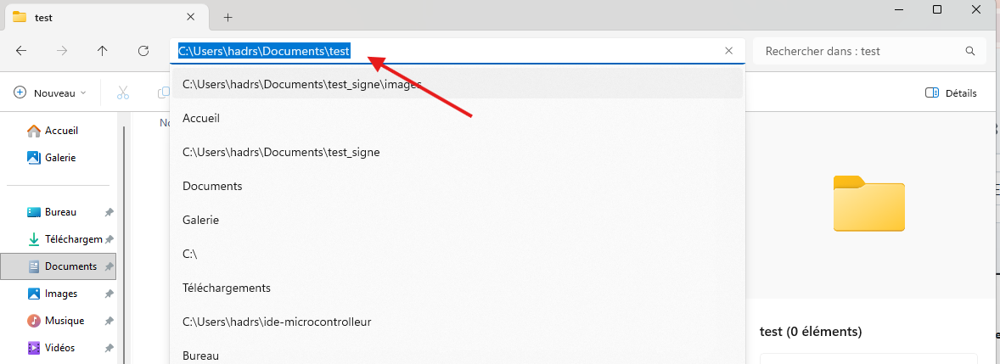
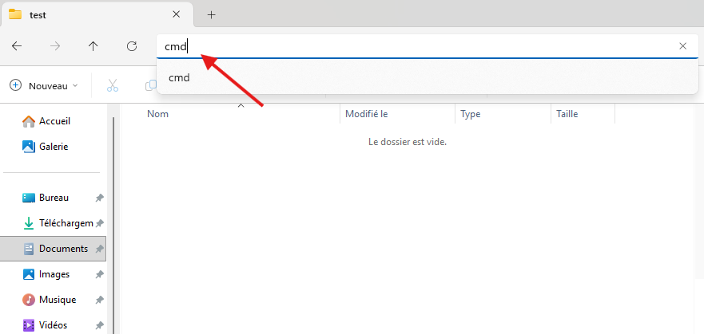

# Characters-recognition-XIAO-esp32-s3-sense

### English Version

**ESP32-S3 Real-Time Air Writing & Character Recognition**

An advanced, lightweight, and fully offline computer vision system designed to capture, analyze, and recognize handwritten characters or shapes in real-time using an **ESP32-S3** camera stream and **Python (OpenCV)**.

Unlike heavy machine learning pipelines, this project relies on a deterministic geometric approach and a structured text-based configuration system.

**Key Features & Capabilities:**

* **Live Video Streaming Integration:** Connects seamlessly to an ESP32-S3 camera module (`/stream`) to process live handwriting frames.
* **Dense Point Extraction & Skeletonization:** Automatically detects the starting point (lowest point on the frame) and extracts a dense, high-resolution web of points covering the entire stroke path.
* **20x20 Binary Grid Mapping:** Divises the Region of Interest (ROI) into a fine binary matrix (20x20 cells) where active touch zones are marked as green cubes and empty zones as red cubes.
* **Geometric Feature Analysis:** Computes precise angles in degrees and detects curve counts to assist in shape evaluation.
* **Config-File-Driven Recognition:** Performs pattern matching entirely against a structured local text file (`characters_config.txt`), eliminating complex model training dependencies.
* **Auto-Organized Dataset Storage:** Automatically sorts and groups new variations by character (e.g., grouping all versions of '1' or 'A' together) whenever a user validates or corrects a trace.
* **Serial UART Communication:** Instantly transmits recognized or validated characters over a serial port to connected microcontrollers or hardware.

---

### French Version

**Système de Reconnaissance d'Écriture et de Caractères en Temps Réel avec ESP32-S3**

Un système de vision par ordinateur léger, performant et entièrement autonome (hors ligne), conçu pour capturer, analyser et reconnaître des caractères ou tracés manuscrits en temps réel via un flux vidéo **ESP32-S3** et **Python (OpenCV)**.

Contrairement aux pipelines de Machine Learning lourds, ce projet repose sur une approche géométrique précise et un système de configuration textuel structuré.

**Fonctionnalités et Capacités Principales :**

* **Flux vidéo en direct :** Connexion transparente au module caméra de l'ESP32-S3 (`/stream`) pour traiter l'écriture en direct.
* **Extraction de points denses :** Détection automatique du point de départ (le point le plus bas du tracé) et maillage dense recouvrant l'intégralité du dessin.
* **Grille binaire 20x20 :** Découpage de la zone d'intérêt en une matrice fine (20x20) où les zones de contact apparaissent en carrés verts et les zones vides en carrés rouges.
* **Analyse géométrique :** Calcul des angles précis en degrés et détection du nombre de courbes pour affiner l'évaluation de la forme.
* **Reconnaissance par fichier de configuration :** Comparaison des tracés effectuée entièrement à partir d'un fichier texte local structuré (`characters_config.txt`), sans dépendance à des bibliothèques de modèles complexes.
* **Organisation automatique des versions :** Classement et regroupement automatique des nouvelles variantes par caractère (ex: toutes les versions du chiffre '1' ou de la lettre 'A' sont regroupées ensemble) lors de la validation ou de la correction par l'utilisateur.
* **Communication Série UART :** Envoi instantané du caractère reconnu ou validé via le port série vers des microcontrôleurs ou du matériel externe.
---


# Installation Guide in English

### Step 1: Flash the camera web server onto the ESP32-S3
1. **Open** the **Arduino IDE** software on your computer.
2. Go to the menu `Tools` > `Board` > `Boards Manager` > `esp32 by Espressif Systems (3.3.11)`.
3. Then go to Tools > Board, an esp32 box will appear, click on it, scroll down and select XIAO_ESP32S3.
4. Import the file "" if not already done. Enter your Wi-Fi network credentials in the code:
```cpp
const char* ssid = "YOUR_WIFI_NAME";
const char* password = "WIFI_PASSWORD";
```
<p align="center">
  
</p>

5. Plug in your ESP32-S3 via USB, select your board and the correct **COM Port** in the `Tools` menu, then click `Upload`.
6. Open the `Serial Monitor` (Tools > Serial Monitor), (set the baud rate to `115200`) the button is in the bottom right, press the board's reset button (the one to the left of the USB-C port), and note the **IP Address** that appears (e.g.: `192.168.1.50`).

<p align="center">
  
</p>

---

### Step 2: Install the Python dependencies
1. Make sure you have **Python** installed on your machine.
2. Open your terminal (or command prompt) and type the following command to install the required libraries:

---

```bash
pip install opencv-python numpy pyserial
```

---

> **Note: opencv-python — The computer vision library (OpenCV) used to capture and process the ESP32-S3 camera's video stream, draw the grids, and analyze the traces.**
> **Note: numpy — An essential math library for quickly manipulating matrices and data arrays (used in particular to manage the 20x20 binary grid).**
> **Note: pyserial — The library that allows your Python script to communicate over serial (UART) with your microcontrollers via COM ports.**

---

### Step 3: Run the Python script
1. Download the .zip file to your computer and click "Extract All".

<p align="center">
  
</p>

2. Open your terminal directly **inside the project folder**.

<p align="center">
  
</p>
<p align="center">
  
</p>

4. Run the program, providing your ESP32's **IP address** and your **COM port**:

---

```bash
python main.py --ip <ESP32_IP_ADDRESS> --com <YOUR_COM_PORT>
```

---

* *Example:* `python main.py --ip 192.168.1.50 --com COM6`

3. Press **Enter** and wait for the transfer to complete. Further instructions can be found in your terminal.


# Guide d'installation en Français

### Étape 1 : Flasher le serveur web de la caméra sur l'ESP32-S3

1. **Ouvrez** le logiciel **Arduino IDE** sur votre ordinateur.
2. Allez dans le menu `Outils` > `Carte` > `Gestionnaire de cartes` > `esp32 par Espressif Systems (3 3.11)`.
3. Ensuite allez dans Outils > Carte, Une case esp32 est alors apparue, cliquer dessus descendez et sélectionnez XIAO_ESP32S3.
4. Importez le fichier "" si pas déjà fait. Renseignez les identifiants de votre réseau Wi-Fi dans le code :
```cpp
const char* ssid = "NOM_DE_VOTRE_WIFI";
const char* password = "MOT_DE_PASSE_WIFI";

```
<p align="center">
  
</p>


5. Branchez votre ESP32-S3 en USB, sélectionnez votre carte et le bon **Port COM** dans le menu `Outils`, puis cliquez sur `Téléverser`.
6. Ouvrez le `Moniteur Série` (Outils > Moniteur série), (réglez la vitesse sur `115200`) le boutton se trouve en bas a droite, appuyez sur le bouton de réinitialisation de la carte (celui a gauche du port usb-c), et notez l'**Adresse IP** qui s'affiche (ex: `192.168.1.50`).

<p align="center">
  
</p>

---

### Étape 2 : Installer les dépendances Python

1. Assurez-vous d'avoir **Python** installé sur votre machine.
2. Ouvrez votre terminal (ou invite de commande) et tapez la commande suivante pour installer les bibliothèques indispensables :
---
```bash
pip install opencv-python numpy pyserial

```
---
> **Note :opencv-python : La bibliothèque de vision par ordinateur (OpenCV) utilisée pour capturer et traiter le flux vidéo de la caméra ESP32-S3, dessiner les grilles et analyser les tracés.**

> **Notenumpy : Une bibliothèque mathématique essentielle pour manipuler rapidement les matrices et les tableaux de données (utilisée notamment pour gérer la grille binaire 20x20).**

> **Notepyserial : La bibliothèque qui permet à votre script Python de communiquer par liaison série (UART) avec vos microcontrôleurs via les ports COM.**


---

### Étape 3 : Lancer le script Python

1. Téléchargez le fichier en .zip sur votre ordinateur et cliqué "Extraire tout".
<p align="center">
  
</p>

2. Ouvrez votre terminal directement **à l'intérieur du dossier** du projet.
<p align="center">
  
</p>
<p align="center">
  
</p>
4. Lancez le programme en indiquant l'**adresse IP de votre ESP32** et votre **port de communication (COM)** :


---

```bash
python main.py --ip <ADRESSE_IP_ESP32> --com <VOTRE_PORT_COM>

```
---


* *Exemple :* `python main.py --ip 192.168.1.50 --com COM6`


3. Appuyez sur **Entrée** et patientez pendant le transfert. La suite des instructions se trouvent dans votre terminal


   const char* ssid = "VOTRE_WIFI";
   const char* password = "VOTRE_MOT_DE_PASSE";
